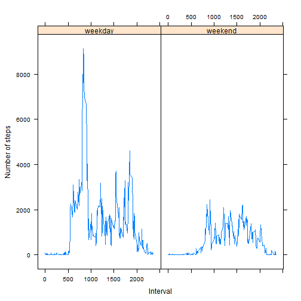

#### Start of by setting the working dir to the dir with the 'activity.zip' file: 
```{r}-
setwd("C:/Users/root/Documents/coursera/reproducible_research/RepData_PeerAssessment1/")
```

## Loading and preprocessing the data
#### We can load csv data directly from a zip archive using unz() function:

```r
rawdata <- read.table(unz("activity.zip", "activity.csv"), header=TRUE, quot ="\"", sep=",")
```

#### We'll use lubridate to convert the date data column from character to a true date datatype:

```r
library(lubridate)
rawdata$date <- ymd(rawdata$date)
```

## What is mean total number of steps taken per day?
#### We can use dplyr to easily filter out NAs and get the  sum of the steps taken per day. We'll set that to the variable tsdp, which will stand for 'total steps per day':

```r
library(dplyr)

ddata <- tbl_df(rawdata)

tspd <- select(ddata, steps, date, interval)  %>% 
      filter(steps != "NA") %>% 
      group_by(date) %>% 
      summarize(sum_steps=sum(steps))
```

#### A histogram of the total steps per day:

```r
hist(tspd$sum_steps,
     xlab ="Steps", ylab = "Frequency (Number of days)", 
     main = "Histogram of steps per day"
     )
```

 

#### The mean of the steps per day:

```r
mean(tspd$sum_steps)
```

```
## [1] 10766.19
```

#### The median of the steps per day:

```r
median(tspd$sum_steps)
```

```
## [1] 10765
```


## What is the average daily activity pattern?

```r
plot(tspd$date, tspd$sum_steps, type= "l", 
     xlab ="Day", ylab = "Steps", 
     main = "Line plot of steps per day"
     )
```

 

## Imputing missing values
#### We can find the number of missing values in the dataset (steps == NA) like this:

```r
count(ddata[is.na(ddata$steps),])
```

```
## Source: local data frame [1 x 1]
## 
##      n
## 1 2304
```

#### Let's find the mean steps per interval accross all the data:

```r
mspi <- select(ddata, steps, date, interval)  %>% 
      filter(steps != "NA") %>% 
      summarize(mean_steps=mean(steps))
as.numeric(mspi)
```

```
## [1] 37.3826
```

#### now to the imputing update rawdata and replace NA with the mean steps per interval (mspi):

```r
rawdata2 <- rawdata
rawdata2[is.na(rawdata2)] <- as.numeric(mspi)
```

#### redo our calculations for total steps per day

```r
ddata2 <- tbl_df(rawdata2)

tspd2 <- select(ddata2, steps, date, interval)  %>% 
      filter(steps != "NA") %>% 
      group_by(date) %>% 
      summarize(sum_steps = sum(steps) )
```

#### A histogram of the total steps per day (redo):

```r
hist(tspd$sum_steps,
     xlab ="Steps", ylab = "Frequency (Number of days)", 
     main = "Histogram of steps per day"
     )
```

 

#### The mean of the steps per day (redo):

```r
mean(tspd2$sum_steps)
```

```
## [1] 10766.19
```

#### The median of the steps per day (redo):

```r
median(tspd2$sum_steps)
```

```
## [1] 10766.19
```

#### After imputing missing data, one difference we notice is that the mean steps per day and median steps per day are the same value (10766.19)

## Are there differences in activity patterns between weekdays and weekends?
#### We'll add a column (wdwe) to indicate weekday or weekend in order to use the value on that column to condition the two plots: a weekday plot and a weekend plot

```r
# note that weekdays are where dayofweek in (2,3,4,5,6)

ddata3 <- select(ddata, steps, date, interval)  %>% 
      mutate(dayofweek = wday(date), 
             wdwe = ifelse(wday(date) %in% c(1,7),'weekend','weekday' )) %>%
      group_by(wdwe,interval) %>%
      filter(steps != "NA")  %>%
      summarize(total_steps =sum(steps))
      
library(lattice)
attach(ddata3)
xyplot(total_steps ~ interval|wdwe,
   type ='l',
   xlab="Interval", ylab="Number of steps", 
   main="")
```

 
